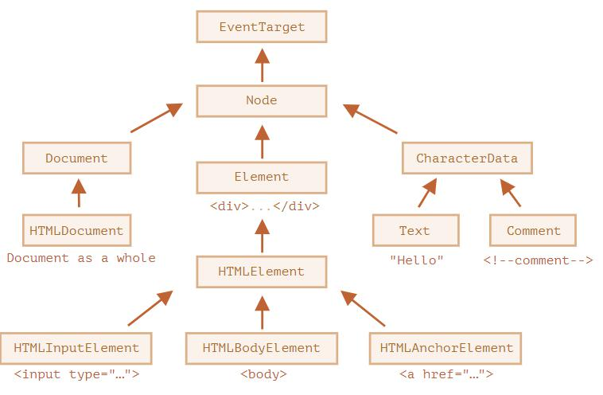

# DOM节点属性: type,tag和content



## innerHTML

innerHTML 属性允许将元素中的 HTML 获取为字符串形式。
```html
<body>
  <p>A paragraph</p>
  <div>A div</div>

  <script>
    alert( document.body.innerHTML ); // 读取当前内容
    document.body.innerHTML = 'The new BODY!'; // 替换它
  </script>

</body>
```
## hidden(display:none)
“hidden” 特性（attribute）和 DOM 属性（property）指定元素是否可见。
```html
<div>Both divs below are hidden</div>

<div hidden>With the attribute "hidden"</div>

<div id="elem">JavaScript assigned the property "hidden"</div>

<script>
  elem.hidden = true;
</script>
```