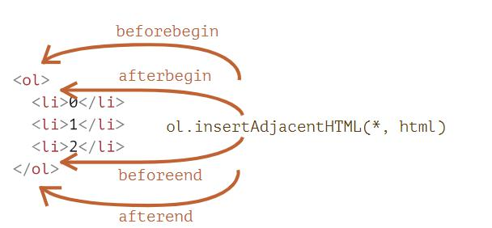

# 修改文档

## 创建节点createElement
```html
//元素节点
let div = document.createElement('div');
// 文本节点：
let textNode = document.createTextNode('Here I am');
```
## 插入节点append
append：document.body.append(div)。
更多的元素插入方法，指明了不同的插入位置：
* node.append(...nodes or strings) —— 在 node 末尾 插入节点或字符串，
* node.prepend(...nodes or strings) —— 在 node 开头 插入节点或字符串，
* node.before(...nodes or strings) —— 在 node 前面 插入节点或字符串，
* node.after(...nodes or strings) —— 在 node 后面 插入节点或字符串，
* node.replaceWith(...nodes or strings) —— 将 node 替换为给定的节点或字符串。
## 将内容“作为 HTML 代码插入”
elem.insertAdjacentHTML(where, html)。
* "beforebegin" —— 将 html 插入到 elem 之前，
* "afterbegin" —— 将 html 插入到 elem 开头，
* "beforeend" —— 将 html 插入到 elem 末尾，
* "afterend" —— 将 html 插入到 elem 之后。
```html
<div id="div"></div>
<script>
  div.insertAdjacentHTML('beforebegin', '<p>Hello</p>');
  div.insertAdjacentHTML('afterend', '<p>Bye</p>');
</script>
```

## 节点移除
node.remove();
## 克隆节点cloneNode
调用 elem.cloneNode(true) 来创建元素的一个“深”克隆 —— 具有所有特性（attribute）和子元素。如果我们调用 elem.cloneNode(false)，那克隆就不包括子元素。
