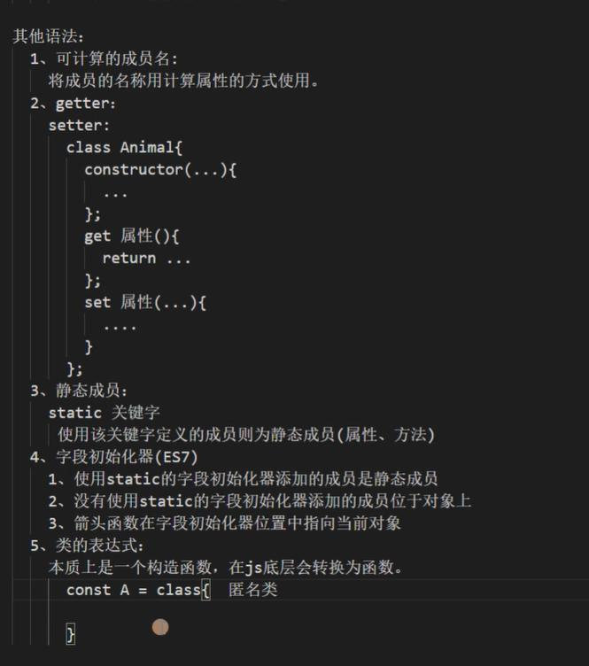
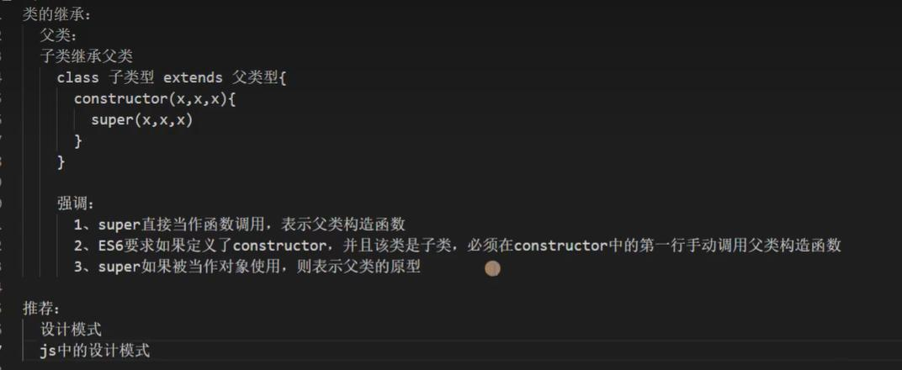

# 类

```js
//es5
function Animal(type,name,age) {
 this.type = type;
 this.name = name;
 this.age = age;
}
Animal.prototype.print = function() {
 console.log(`${this.type}`);
}
const dog = new Animal('dog', 'tom', 12);
dog.print();
//问题：1.属性和方法分开
//2.原型对象中的成员可以被遍历
//3.默认情况下构造函数不可以作为普通函数调用
```
es6中：
* 类的声明不会被提升
* 类中的属性方法不可以被遍历
```js
//es6
class Animal {
    constructor(type, name, age) {
        this.type = type;
        this.name = name;
        this.age = age;
    }
	get age() {}
	set age(...) {}
    print() {
        console.log(`${this.type}`);
    }
	//static 成员。方法
	static a = 1;
}

```

## 继承extends
```js
class Cat extends Animal {
    constructor(type, name, age,sex) {
        //constructor必须存在super
        super(type, name, age);
        this.sex = sex;
    }
	print() {
		//继承父类的方法
		super.print();
		console.log(`${this.name}`);
	}
}

```
