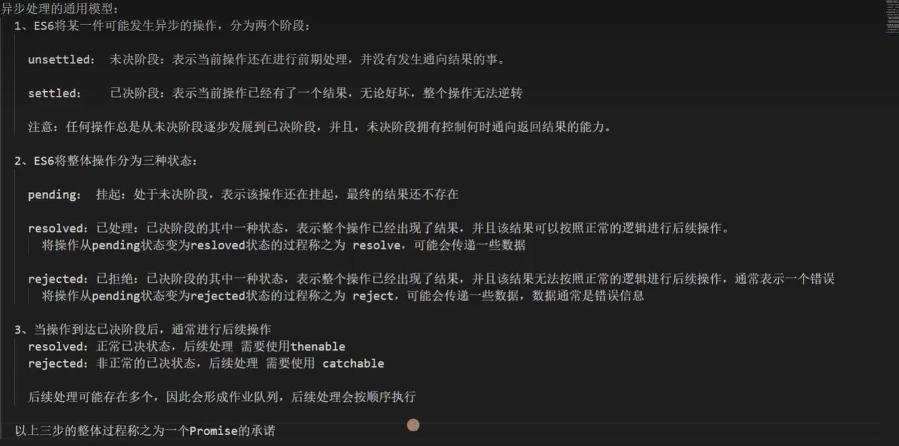
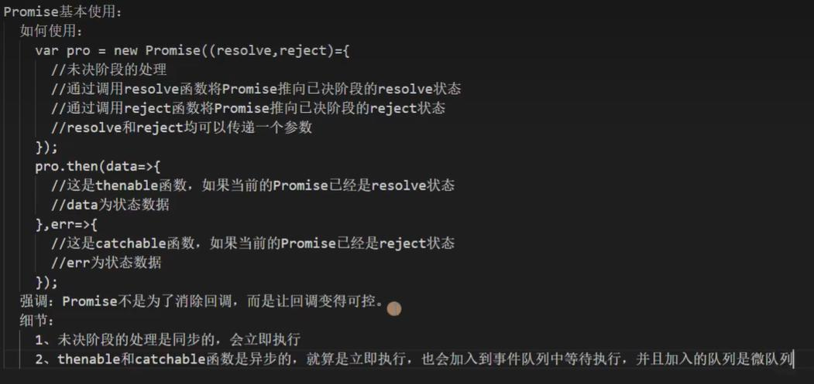

# 异步处理

通用模型：
	1. 异步操作，两个阶段：unsettled，settled
	2. 三状态：pending，resolved，rejected
	

```js
const promise = new Promise((resolve, reject) => {
    setTimeout(() => {
        if (Math.random() < 0.5) {
            resolve('小于0.5');
        } else {
            reject('大于0.5');
        }
    },1000);
});
promise.then(
	(data) => {
		console.log(data);
	},
	(err) => {
		console.log(err);
	}
);
```

## async/await
async 修饰的函数的返回值会被包装为一个promise
```js
async function foo() {
	return 1;
}
```