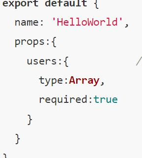
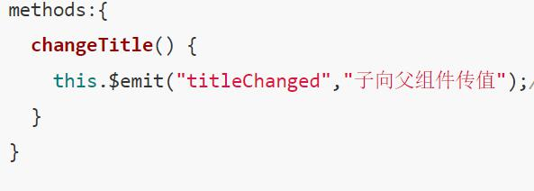
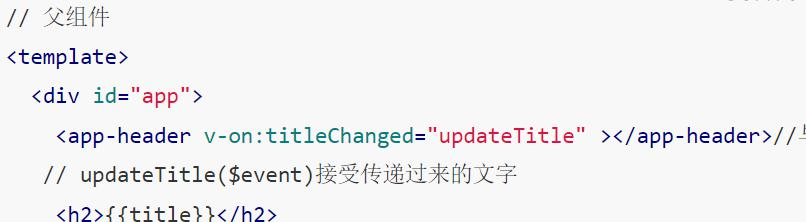

# vue知识总结

## 对mvc，mvp，mvvm的理解
1. MVC指model(数据保存)，view(用户界面)，contruller(业务逻辑)
- view传送指令到controller
- controller完成 业务逻辑后，交给model改变状态
- model将更新的状态发送给view，渲染页面
- 所有通信单向
2. mvp：把mvc的controller改为presenter，更改双向通信方式、
- 通信都是双向的
- model不与view直接联系，通过presenter
3. mvvm：基本与mvp一致，presenter改为viewmodel
- 采用双向绑定，view的改动，自动反映在viewmodel上

## 如何理解 Vue 是异步执行 DOM 更新的 
vue检测到数据变化，将开启一个队列，存入数据改变，等待vue扫描队列刷新页面

## 深入响应式原理-如何追踪变化
1. 定义在data中的数据，vue将遍历data，并且通过object.definedproperty设置getter/setter
2. 每一个组件都有一个watcher实例对象，将属性记录为依赖，检测依赖的变化
3. 通过订阅者-观察者模式，检测数据的变化的行为

## 非父子组件如何通信 ？

通过全局事件总线bus
```js
//bus.js
import Vue from 'vue';
export default new Vue;

//A组件，在methods中emit注册事件
import bus from 'bus.js'
bus.$emit('msg', 'hello B');
//B组件，通过on监听事件
bus.$on('msg', (e) => {
	....
})
```
## Proxy 可以实现什么功能？
vue3中通过proxy代替object.definedproperty,实现数据劫持，实现数据响应式
```js
const p = new Proxy(target, handler);
target: 需要添加代理的对象,handler:自定义对象中的操作
```

## vue生命周期
1. 生命周期函数钩子
- beforeCreate：实例初始化，computed等还不能访问，数据data还没有加载
- created：实例创建完成，可访问数据方法，但是dom还没有挂载，不可以进行大量复杂的ajax请求
- beforeMount：挂载开始之前被调用
- mounted：实例挂载到DOM上,可以操作dom，发送ajax
- beforeUpdate：响应式数据更新时调用
- updated：虚拟dom重新渲染之后调用
- beforeDestroy：实例销毁前调用，可以用于定时器的销毁，事件的解绑
- destroyed：实例销毁

## 组件通信的方式
组件中的数据共有三种形式：data、props、computed
1. props: 父传子

2. $emit/$on: 子组件向父组件传值（通过事件形式）


3. vuex
* vuex实现了单向数据流，全局拥有一个state存放数据，更改数据必须由mutation进行
* 组件通过dispatch，执行action的方法
* action：处理模块```$store.dispatch('action 名称',data)```，然后commit()触发mutation调用，更新state
* commit：唯一直接操作mutation的方法
4. $bus
5. $parent/$children
6. $attrs/$listeners
通过v-bind绑定的值都会放在attrs(如果没有props)
7. provide/inject
provide 和 inject 绑定并不是可响应的
* provide祖先实例this
* 通过Vue.observable优化provide
```js
provide() {
	this.xxx = Vue.observable('hello');
	return {
		xxx: this.xxx
	}
}
```
## 说说你对 SPA 单页面的理解，它的优缺点分别是什么？
spa: 不会因为用户的操作进行页面的跳转或加载，而是通过路由，实现UI交互
1. 优点
- 用户体验好，避免了大量页面的跳转
- 对于服务器的压力小，减少了http请求
- 前后端分离，结构清晰
2. 缺点
- 初次加载慢
- 不能使用浏览器的前进后退功能，要自己建立前进后退路由管理
- SEO不适配

## v-show 与 v-if 有什么区别？
1. v-if 根据条件动态销毁和创建组件
2. v-show：根据条件动态隐藏组件

## Class 与 Style 如何动态绑定
通过v-bind
```js
<div :style='color'></div>
data() {
	return {
		color: {
			color: 'red'
		}
	}
}
```
## 怎样理解 Vue 的单向数据流？
父组件通过 props传值，子组件改变了值，但是，父组件的值没有一起改变

## methods，computed 和 watch 的区别和运用的场景？
1. computed：依赖于属性，只有属性值改变，computed才会触发，同时，computed还具有缓存
2. watch：类似数据监听，每当监听的数据改变，就执行回调，不能缓存，支持异步操作
3. methods：主要用于业务逻辑。
4. 使用场景
- computed适用于一个数据受多个数据的影响，而且需要利用缓存的特性
- watch适用于监听一个数据，影响多个数据，还有异步操作。

## 直接给一个数组项赋值，Vue 能检测到变化吗？
vue不能检测到以下数组的改动方式：
- 利用索引：this.items[index] = 'zzz'
- 修改数组长度：this.items.length = newlength

vue提供的解决方案：
- this.$set(this.items, index, newvalue)
- this.items.splice(newlength)

## 对vue项目进行的优化
1. 代码层面的优化
- v-if和v-show的区分
- computed和watch的区分
- v-for使用key
- 长列表性能优化
- 事件的销毁
- 图片懒加载
- 路由懒加载
- 第三方组件的按需引入(如element-ui)
- ssr
2. webpack
- 图片压缩
- 代码复用
- 模板预编译
- css复用
3. web优化
- 开启gzip压缩
- 浏览器缓存
- cdn
## vue3新特性
1. Object.definedProperty的限制
- 只能监测属性，不能监测对象

## vue事件绑定原理
原生的事件绑定是addEventListener，vue的是$on的自定义事件

