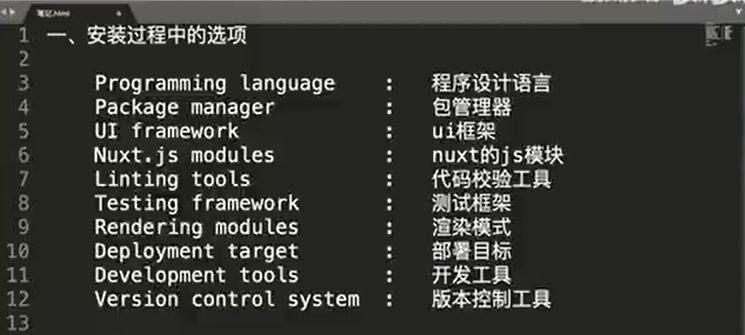

# Nuxt3是基于Vue3发布的SSR框架，也是Vue全家桶系列的一员 
* SPA应用：也就是单页应用，这些多是在客户端的应用，不能进行SEO优化（搜索引擎优化）。

* SSR应用：在服务端进行渲染，渲染完成后返回给客户端，每个页面有独立的URL，对SEO友好
<br>

Vue开发的应用默认是单页应用（SPA应用），但如果你想针对于搜索优化，就需要使用Vue的SSR模式开发，而Nuxt3就是Vue的SSR开发的框架。
## 使用create-nuxt-app
确保已安装 yarn、npx（默认情况下包含在 npm v5.2+ 中）或 npm （v6.1+）
```shell
// yarn
yarn create nuxt-app <project-name>
// npx
npx create-nuxt-app <project-name>
// npm
npm init nuxt-app <project-name>

// 执行
cd <project-name>
npm run dev

```
## 安装过程中的选项

## 目录结构

## 手动安装
```shell
mkdir <project-name>
cd <project-name>
touch package.json
```
package.json 的内容
```shell
{
  "name": "my-app",
  "scripts": {
    "dev": "nuxt",
    "build": "nuxt build",
    "generate": "nuxt generate",
    "start": "nuxt start"
  }
}
```
## 安装Nuxt
```shell
npm install nuxt
```
## 创建页面
```shell
mkdir pages
touch pages/index.vue
//放入内容
<template>
  <h1>Hello world!</h1>
</template>
```
## 启动
```shell
npm run dev
```
