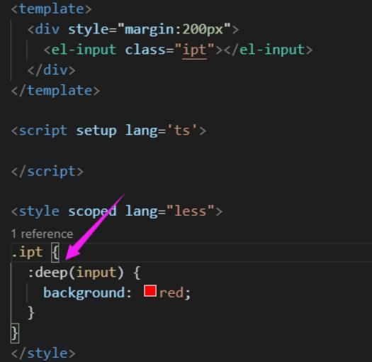

# scoped & 样式穿透

用于修改很多vue常用的组件库（element等），需要更改其他的样式

* scoped通过给dom添加不重复的属性(data-v-hash) 通过postCSS实现
* 总在css选择器末尾
* 如果组件内部包含有其他组件，只会给其他组件的最外层标签加上当前组件的data属性

## 样式穿透:deep()
作用就是用来改变 属性选择器的位置<br/>
例子：


## 插槽选择器:slotted()
在组件中设置插槽的样式
```css
<style lang="scss" scoped>
:slotted(.list) {
    color: red;
}
</style>
```

## 全局样式
```css
<style lang="less" scoped>
:global(div){
    color:red
}
</style>
```
## 动态css
单文件组件的 <style> 标签可以通过 v-bind 这一 CSS 函数将 CSS 的值关联到动态的组件状态上
```html
<template>
    <div class="div">
       小满是个弟弟
    </div>
</template>
 
<script lang="ts" setup>
import { ref } from 'vue'
const red = ref<string>('red')
</script>
 
<style lang="less" scoped>
.div{
   color:v-bind(red)
}
 
</style>
```