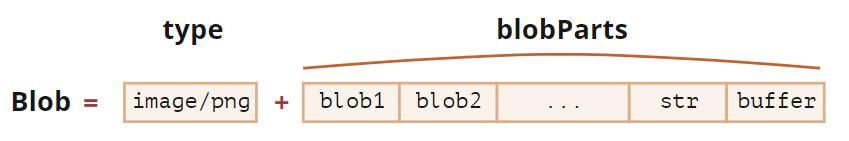

# 二进制数据blob

# blob
<red>Blob 对象是不可改变的</red>
Blob 由一个可选的字符串 type（通常是 MIME 类型）和 blobParts 组成 —— 一系列其他 Blob 对象，字符串和 BufferSource。

构造函数语法
```shell
new Blob(blobParts，options);
```
* blobParts 是 Blob/BufferSource/String 类型的值的数组。
* options 可选对象：
* type —— Blob 类型，通常是 MIME 类型，例如 image/png，
* endings —— 是否转换换行符，使 Blob 对应于当前操作系统的换行符（\r\n 或 \n）。默认为 "transparent"（啥也不做），不过也可以是 "native"（转换）。
例如:
```js
//创建字符串blob
let blob = new Blob(['<html>...</html>'],{type: 'text/html'});
// 从类型化数组（typed array）和字符串创建 Blob
let hello = new Uint8Array([72, 101, 108, 108, 111]); // 二进制格式的 "hello"

let blob = new Blob([hello, ' ', 'world'], {type: 'text/plain'});
```
用 slice 方法来提取 Blob 片段
## Blob用作URL
Blob 可以很容易用作 <a>、 或其他标签的 URL，来显示它们的内容
```js
<!-- download 特性（attribute）强制浏览器下载而不是导航 -->
<a download="hello.txt" href='#' id="link">Download</a>

<script>
let blob = new Blob(["Hello, world!"], {type: 'text/plain'});

link.href = URL.createObjectURL(blob);
</script>
```
## Blob转化为base64
URL.createObjectURL 的一个替代方法是，将 Blob 转换为 base64-编码的字符串
```js
let reader = new FileReader();
reader.readAsDataURL(blob); // 将 Blob 转换为 base64
```
## image转blob
图像操作是通过 <canvas> 元素来实现的：
 1. 使用 canvas.drawImage 在 canvas 上绘制图像（或图像的一部分）。
 2. 调用 canvas 方法 .toBlob(callback, format, quality) 创建一个 Blob，并在创建完成后使用其运行 callback

```js
// 获取任何图像
let img = document.querySelector('img');

// 生成同尺寸的 <canvas>
let canvas = document.createElement('canvas');
canvas.width = img.clientWidth;
canvas.height = img.clientHeight;

let context = canvas.getContext('2d');

// 向其中复制图像（此方法允许剪裁图像）
context.drawImage(img, 0, 0);
// 我们 context.rotate()，并在 canvas 上做很多其他事情

// toBlob 是异步操作，结束后会调用 callback
canvas.toBlob(function(blob) {
  // blob 创建完成，下载它
  let link = document.createElement('a');
  link.download = 'example.png';

  link.href = URL.createObjectURL(blob);
  link.click();

  // 删除内部 blob 引用，这样浏览器可以从内存中将其清除
  URL.revokeObjectURL(link.href);
}, 'image/png');
```