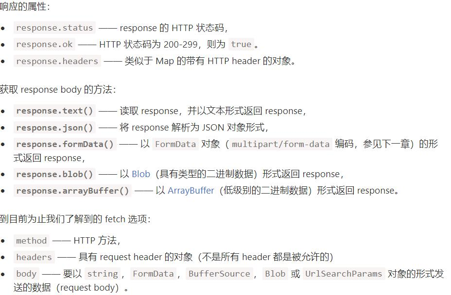

# fetch

## 语法
典型的 fetch 请求由两个 await 调用组成
```js
let fetchPromis = fetch(url, [options]);
//浏览器立即启动请求，并返回一个该调用代码应该用来获取结果的 promise。
```
获取响应通常需要经过两个阶段:
1. 当服务器发送了响应头（response header），fetch 返回的 promise 就使用内建的 Response class 对象来对响应头进行解析
response 的属性中看到 HTTP 状态:status---http状态码，ok---布尔值，200-299为true
2. 获取 response body，我们需要使用一个其他的方法调用
Response 提供了多种基于 promise 的方法，来以不同的格式访问 body
* response.text() —— 读取 response，并以文本形式返回 response，
* response.json() —— 将 response 解析为 JSON 格式，
* response.formData() —— 以 FormData 对象（在 下一章 有解释）的形式返回 response，
* response.blob() —— 以 Blob（具有类型的二进制数据）形式返回 response，
* response.arrayBuffer() —— 以 ArrayBuffer（低级别的二进制数据）形式返回 response，
例如：
```js
let response = await fetch(url);
let result = await response.json();
```
或者
```js
fetch(url).then(response=>response.json())
```
## response header
```js
let response = await fetch('https://api.github.com/repos/javascript-tutorial/en.javascript.info/commits');

// 获取一个 header
alert(response.headers.get('Content-Type')); // application/json; charset=utf-8

// 迭代所有 header
for (let [key, value] of response.headers) {
  alert(`${key} = ${value}`);
}
```
## POST请求
创建一个 POST 请求，或者其他方法的请求，我们需要使用 fetch 选项
* method —— HTTP 方法，例如 POST，
* body —— request body，其中之一：
	* 字符串（例如 JSON 编码的），
	* FormData 对象，以 multipart/form-data 形式发送数据，
	* Blob/BufferSource 发送二进制数据，
	* URLSearchParams，以 x-www-form-urlencoded 编码形式发送数据，很少使用
1. 发送 JSON 时，我们会使用 headers 选项来发送 application/json，这是 JSON 编码的数据的正确的 Content-Type。
2. 请求的 body 是字符串，则 Content-Type 会默认设置为 text/plain;charset=UTF-8
```js
let user = {
  name: 'John',
  surname: 'Smith'
};

let response = await fetch('/article/fetch/post/user', {
  method: 'POST',
  headers: {
    'Content-Type': 'application/json;charset=utf-8'
  },
  body: JSON.stringify(user)
});

let result = await response.json();
alert(result.message);
```

